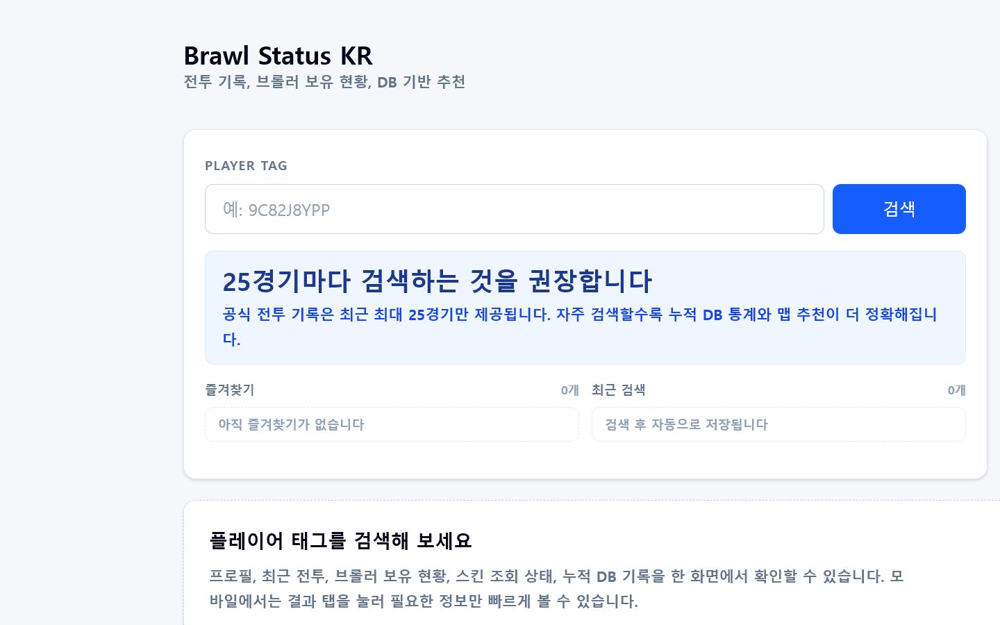
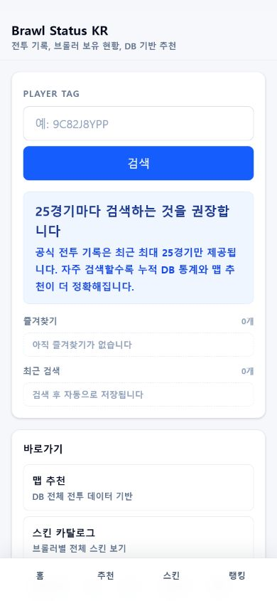

# Brawl Status KR

플레이어 검색에서 쌓인 전투 표본으로 한국어 전적, 보유 브롤러, 맵 추천, 팀 조합, 카운터를 제공하는 Brawl Stars 분석 서비스입니다.

- 라이브 서비스: <https://www.brawl-o1.site/>
- 프로젝트 상태: `v0.1.0` 공개 준비 중
- 라이선스: [MIT](LICENSE) — 프로젝트가 직접 작성한 소스 코드와 문서에 적용됩니다.
- 비공식 고지: Supercell의 승인·후원·제휴를 받지 않은 팬 프로젝트입니다.

## 왜 만들었나요?

한국어 이용자가 플레이어 태그 하나로 최근 전투, 보유 장비·스킨, 누적 기록을 확인하고, 통계가 어디서 왔는지 함께 볼 수 있게 하려는 프로젝트입니다. 단순 전적 화면뿐 아니라 검색할 때마다 최근 전투 표본이 중복 없이 쌓이고 맵·팀·카운터 정보가 개선되는 구조를 지향합니다.

## 주요 기능

- 플레이어 태그 정규화와 프로필 검색
- 최근 최대 25경기의 승패·주력 모드·연속 플레이 요약
- 보유 브롤러, 가젯, 스타파워, 하이퍼차지, 기어, 스킨 표시
- 전투 시간·지문 UNIQUE 제약을 이용한 중복 저장 방지
- 검색 표본 기반 맵별 브롤러 추천과 표본 신뢰도
- 팀전 참가자를 펼친 팀 조합·카운터 집계
- BrawlAPI 원본 기반 한국어 번역·스킨 카탈로그
- Brawlify 기반 이벤트·맵·모드·브롤러 정보
- 모바일 결과 탭, 최근 검색, 브라우저별 즐겨찾기

## 화면

| 데스크톱 | 모바일 |
| --- | --- |
|  |  |

데이터 표본과 중복 방지 방식을 설명하는 화면도 [방법론 페이지](docs/assets/methodology-desktop.png)에서 확인할 수 있습니다.

## 데이터는 어떻게 계산하나요?

메타 통계는 전체 Brawl Stars 이용자의 공식 통계가 아닙니다. 이 서비스에서 검색된 플레이어의 최근 전투를 누적한 표본이므로 지역·실력대·검색 빈도에 따라 편향될 수 있습니다.

- 같은 태그의 같은 전투는 `(player_tag, battle_time)`과 `(player_tag, battle_fingerprint)` 제약으로 건너뜁니다.
- 팀전은 같은 전투 지문을 한 번만 고른 뒤 양 팀 참가자를 펼쳐 계산합니다.
- 쇼다운은 검색된 플레이어 관점의 순위를 사용합니다.
- 친선전은 통계에서 제외합니다.
- 맵·브롤러 조합은 최소 5판일 때만 노출하며, 화면 값은 최대 60초 캐시될 수 있습니다.
- 저장된 고유 태그 수는 고유 사용자 수가 아닙니다.

자세한 계산식과 한계는 [데이터 산정 방식](docs/DATA_METHODOLOGY.md)을 확인하세요.

## 기술 스택

- Next.js 16, React 19, TypeScript
- Tailwind CSS 4
- PostgreSQL, Drizzle ORM
- Vitest, ESLint
- Vercel 배포 구조

전체 흐름과 경계는 [아키텍처 문서](docs/ARCHITECTURE.md)에 있습니다.

## 로컬 실행

Node.js 20 이상과 PostgreSQL이 필요합니다. Windows PowerShell에서는 `npm.cmd`를 사용합니다.

```powershell
git clone https://github.com/psh1234567890/brawl_status_kr.git
cd brawl_status_kr
Copy-Item .env.example .env.local
npm.cmd ci
npm.cmd run db:migrate
npm.cmd run dev
```

더 안전한 운영·마이그레이션 절차는 [직접 실행 가이드](docs/SELF_HOSTING.md)를 읽어주세요.

## 환경 변수

| 이름 | 필수 | 용도 |
| --- | --- | --- |
| `DATABASE_URL` | 예 | 앱 런타임 PostgreSQL 연결 |
| `DIRECT_URL` | 마이그레이션 시 | DB 점검·마이그레이션 직접 연결 |
| `BRAWL_STARS_API_KEY` | 예 | 서버의 Brawl Stars API 인증 |
| `BRAWL_STARS_API_BASE_URL` | 예 | 공식 API 또는 직접 관리하거나 명시적으로 신뢰한 HTTPS 프록시 |
| `NEXT_PUBLIC_ADSENSE_CLIENT_ID` | 선택 | 광고 클라이언트 ID |
| `NEXT_PUBLIC_ADSENSE_SLOT_ID` | 선택 | 광고 슬롯 ID |

실제 값을 커밋하지 마세요. `.env.example`에는 변수 이름과 빈 값만 있습니다. 묵시적 기본 프록시는 없으며, 운영자가 `BRAWL_STARS_API_BASE_URL`을 명시해야만 서버 API 키가 전송됩니다.

## 데이터베이스

```powershell
npm.cmd run db:migrate
npm.cmd run db:check
```

마이그레이션은 기존 `battle_logs`를 보존하면서 타임스탬프, 전투 지문, 브롤러 ID, JSON 컬럼과 UNIQUE·조회 인덱스를 추가합니다. 운영 DB에서는 백업과 복구 계획을 먼저 준비하세요.

## 검증 명령

```powershell
npm.cmd run lint
npm.cmd run test
npm.cmd run build
```

CI는 API 키와 운영 DB 없이 이 세 명령을 실행하도록 구성돼 있습니다. DB 연동과 라이브 저장 검증은 별도의 승인된 환경이 필요합니다.

## 데이터와 제3자 출처

- Brawl Stars API 또는 설정된 프록시: 공개 게임 프로필·전투·클럽·랭킹
- Brawlify: 맵·모드·브롤러·이벤트 메타데이터
- BrawlAPI: 번역·스킨 카탈로그 생성 원본

각 제공자의 현재 정책과 라이선스가 우선합니다. 자세한 내용과 아직 확인할 항목은 [THIRD_PARTY_NOTICES.md](THIRD_PARTY_NOTICES.md)에 기록합니다.

## 기여

처음 기여하는 분도 [CONTRIBUTING.md](CONTRIBUTING.md)의 순서대로 실행할 수 있습니다. 특히 다음 기여를 환영합니다.

- 번역·문서의 실제 구현 불일치
- 태그 정규화·전투 지문·중복 방지 테스트
- 익명화 fixture 기반 팀전·쇼다운 통계 회귀 테스트
- 모바일·접근성·오류 메시지 개선
- 데이터 정확성 제보

모든 참여자는 [행동 강령](CODE_OF_CONDUCT.md)을 따라야 합니다.

## 보안과 개인정보

- 보안 취약점은 공개 이슈가 아니라 [SECURITY.md](SECURITY.md)의 비공개 절차로 신고해 주세요.
- 개인정보와 측정 원칙은 [docs/PRIVACY.md](docs/PRIVACY.md)에 있습니다.
- 실제 태그, 운영 DB 덤프, API 키, `.env`는 이슈·PR·fixture에 포함하지 않습니다.

## 라이선스와 팬 콘텐츠

프로젝트가 직접 작성한 소스 코드와 문서는 [MIT License](LICENSE)로 공개합니다. 결정 근거와 적용 범위는 [라이선스 결정 문서](docs/codex-for-oss/license-recommendation.md)에 있습니다.

Brawl Stars, Supercell, 관련 명칭·이미지·게임 데이터와 제3자 데이터는 각 권리자에게 속하며 MIT License가 그 권리를 부여하지 않습니다. 저장소 아이콘은 게임 이미지를 쓰지 않는 프로젝트 고유의 문자 도안입니다. 이 자료는 비공식이며 Supercell의 승인을 받지 않았습니다. [Supercell Fan Content Policy](https://supercell.com/en/fan-content-policy/)를 확인하세요.

## 현재 상태와 로드맵

현재 우선순위는 제3자 데이터 조건 확인, 첫 릴리스, 실제 피드백·사용량 근거입니다. 계획과 현재 기능을 섞지 않으며 자세한 내용은 [ROADMAP.md](docs/ROADMAP.md)와 [CHANGELOG.md](CHANGELOG.md)에 있습니다.

## 피드백

GitHub Issues에서 버그, 기능 제안, 데이터 정확성 양식을 사용할 수 있습니다. 보안 취약점은 공개 이슈 대신 [SECURITY.md](SECURITY.md)의 비공개 신고 절차를 이용해 주세요.

지원 범위와 공식 Supercell 문의가 필요한 항목은 [SUPPORT.md](SUPPORT.md)를 확인하세요.
